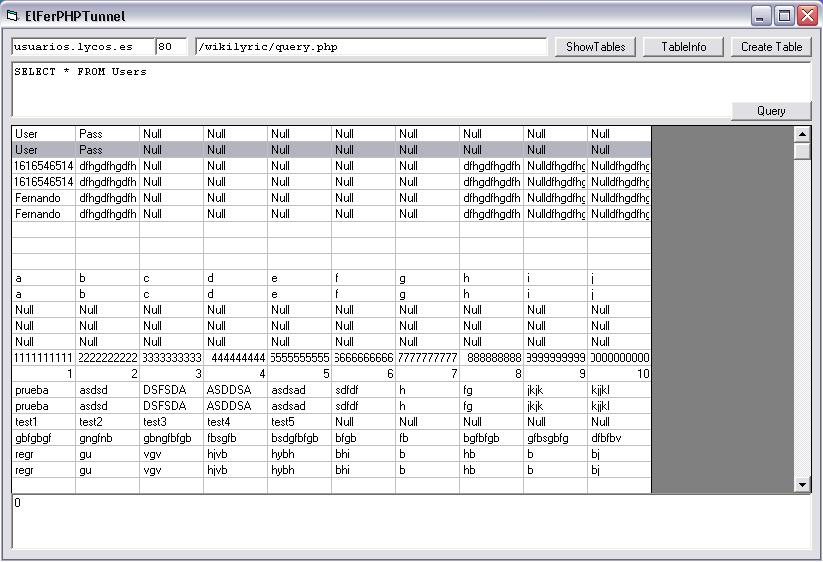



## ElFer PHP Tunnel

### Description

This is an example of connect to a remote My SQL DB hosted at Lycos WHITOUT an open remote port, using a PHP Tunnel hosted there.

This is the first and incomplete version of a future Query analizer. PLEASE VOTE
 
### More Info
 

             |
---                |---
**Submitted On**   |2006-09-01 03:53:50
**By**             |[Fernando C&\#233;sar Chiola](https://github.com/Planet-Source-Code/PSCIndex/blob/master/ByAuthor/fernando-c-233-sar-chiola.md)
**Level**          |Intermediate
**User Rating**    |4.7 (14 globes from 3 users)
**Compatibility**  |VB 5\.0, VB 6\.0
**Category**       |[Databases/ Data Access/ DAO/ ADO](https://github.com/Planet-Source-Code/PSCIndex/blob/master/ByCategory/databases-data-access-dao-ado__1-6.md)
**World**          |[Visual Basic](https://github.com/Planet-Source-Code/PSCIndex/blob/master/ByWorld/visual-basic.md)
**Archive File**   |[ElFer\_PHP\_201702912006\.zip](https://github.com/Planet-Source-Code/fernando-c-233-sar-chiola-elfer-php-tunnel__1-66430/archive/master.zip)

